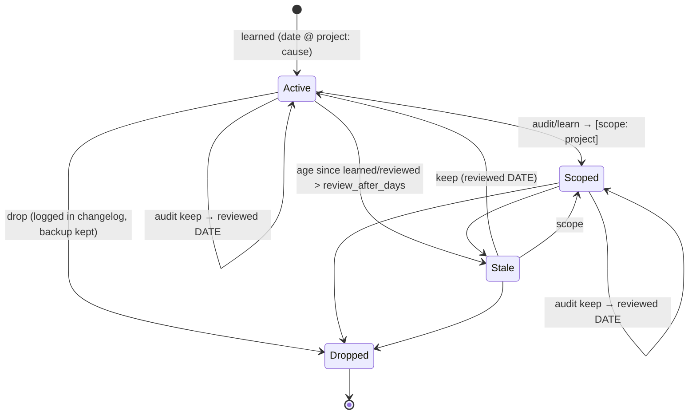

# Spec — rule provenance, scoping & review (lifecycle-guard v1.6.0)

## 1. Goal
Every learned rule records **when** and **where** (origin project) it was learned and **why**, can be
**scoped** to a project so it is not applied everywhere, and can be **reviewed** later: an audit lists
stale, origin-unknown and project-specific-but-global rules for a keep / scope / drop decision, and
stamps the decision on the rule.

## 2. Actors
- **User** — corrects Claude; runs `/lifecycle-guard:audit`; edits the plain-text KB by hand.
- **Agent (in the moment)** — writes a rule after a correction (prompted by `on_prompt.py`).
- **Background learner** — headless `/learn auto` at session end; `/bootstrap` one-time seed.
- **Lifecycle skill / reviewer agent** — read rules and must honour `[scope: …]`.

## 3. Rule state machine

Legacy rules (no `@ project`) are Active with origin unknown; audit flags them.

## 4. Capabilities
- Format: `- [ ] [scope: <project>]? <rule> _(learned YYYY-MM-DD @ <project>: <cause>)_ _(reviewed YYYY-MM-DD)_?`
- `on_prompt.py` injects the concrete project name (cwd basename) into the instruction.
- `/learn` takes origin from the digest's `[project]` prefix; scopes rules naming project-specific things.
- `/bootstrap` takes origin from transcript `cwd` (consistent naming with the hook).
- `digest.py --audit` → markdown report: per-rule date/origin/scope/age + flags
  (`no-origin`, `stale`, `looks-project-specific`), plus counts. `--audit --json` for tooling.
- `/lifecycle-guard:audit` → runs the report, asks keep/scope/drop per flagged rule (or applies
  a single suggested decision in `auto`), backs up, edits, stamps `_(reviewed DATE)_`, logs to changelog.
- `/lg-status` shows the audit counts line.
- Skill + reviewer: a `[scope: X]` rule applies only when cwd basename is X; elsewhere it is N/A.

## 5. Failure / edge cases
- Legacy format, missing date, malformed line → parsed leniently, flagged (`no-origin` / `malformed`), never crash, never silently dropped. Unstamped bullets under `## Learned` are audited; seed checklist items outside `## Learned` are the plugin baseline and out of scope.
- Generic basenames (test, config, src, …) and placeholder hosts (example.com) don't trigger `looks-project-specific`; a project must appear in 2+ prompts to count.
- cwd empty / `/` → project `?` (flagged as no-origin).
- Same basename for two repos → acceptable collision; documented.
- KB missing → audit prints "no knowledge base" and exits 0.
- Headless: `/audit` only prints the report, never edits. Drops are confirmed one by one and logged verbatim.

## 6. Cross-cutting
- Placement & reuse: extends existing `digest.py` (new flag, no new script), existing hooks, existing
  commands; one new command `audit.md` (status is read-only, learn is ingest — review is a distinct
  write action that needs confirmation, so it gets its own entry point).
- Config: `review_after_days` (default 90) added to `DEFAULT_CONFIG`; existing configs merge defaults.
- Business values: 90 days ≈ a quarter — long enough that fresh rules don't nag, short enough that
  rules tied to a refactored codebase get re-checked. Overridable.
- Privacy: origin is a directory basename only, never a full path; KB stays local.
- Audit trail: drop/scope/keep logged to `changelog.md`, files backed up first (existing mechanism).

## 7. Checklist coverage
Migration ✓ §5 (legacy parsed + flagged; no destructive rewrite). Same rules across entry points ✓ §4
(hook, learn, bootstrap, skill all use one format). Fix-everywhere ✓ (all format references updated).
UI/CTA/tenant/payments items N/A — CLI/Markdown plugin, no UI or tenants.

## 8. Acceptance
- Given a correction in repo `foo`, when the hook fires, then the injected instruction contains `@ foo`.
- Given a legacy rule, when `--audit` runs, then it is listed with flag `no-origin`.
- Given a rule learned 200 days ago and review_after_days 90, then flag `stale`; after `reviewed <today>`, not stale.
- Given an unscoped rule naming a known project or a hostname, then flag `looks-project-specific`.
- Given `[scope: foo]`, the audit shows scope `foo` and doesn't flag project-specific.

## 9. Out of scope
Automatic hit-counting of "rule never triggered" (no reliable signal); auto-dropping rules.
